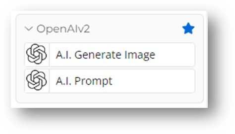
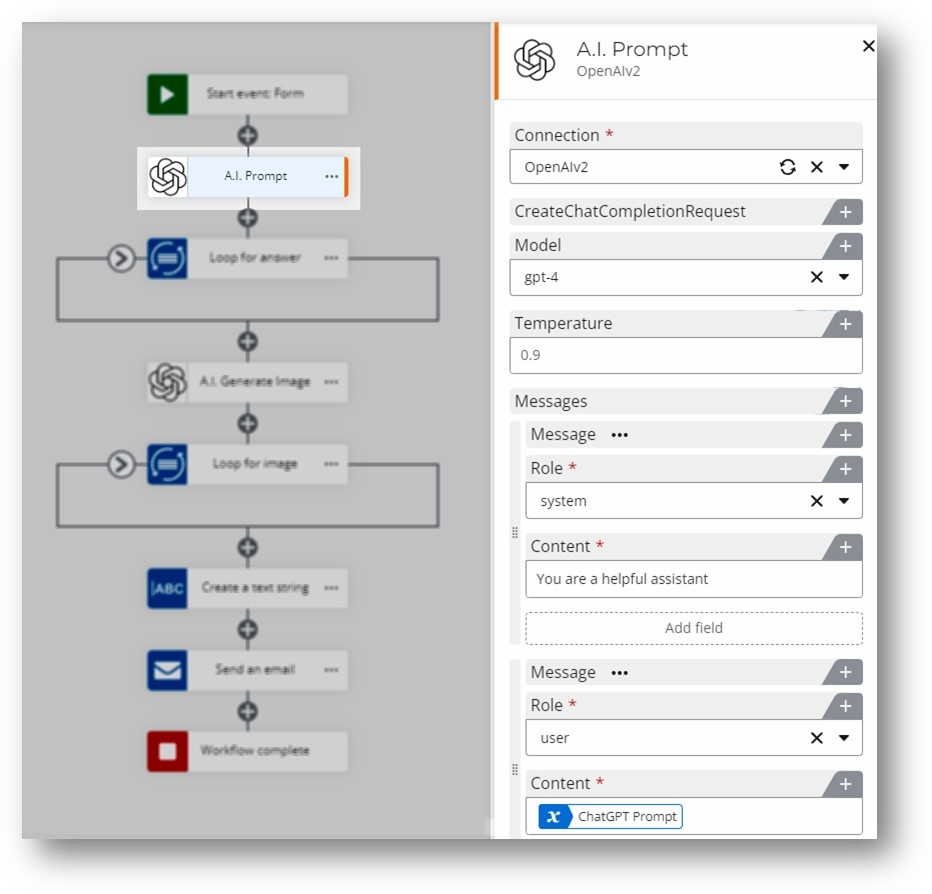
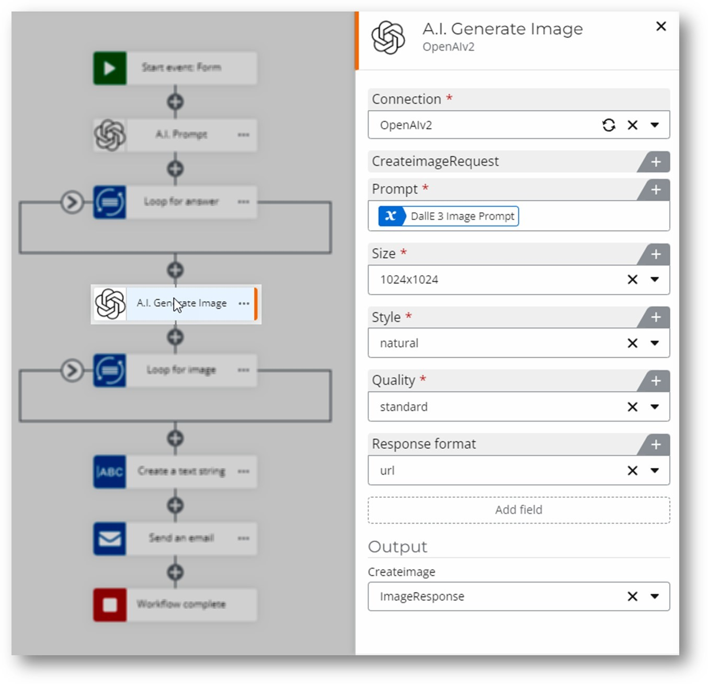

# Connector-OpenAI

## Model Usage Changes
- **Previous Models**: gpt-3.5-turbo-instruct, babbage-002, davinci-002.
- **New Approach**: Now uses the Chat endpoint, moving away from the 'Legacy' Completion Endpoint.
- **Current Models**: Limited to GPT-4 and GPT-3.5 Turbo.

## Integration of DALL·E 3
- **Latest Model**: Updated to integrate DALL·E 3, released in November 2023.
- **Purpose**: For image generation tasks.

## Simplification of Model Selection and Defaults
- **Streamlined Model List**: Easier for end-users to understand and choose.
- **Exclusive Use of DALL·E 3**: For image generation, replacing DALL·E 2.

## Removed Features
- **Discontinued Actions**: Image Edit, Variation, and Sentiment Analysis.
- **Reason**: These can be achieved with normal prompting.

## Reduction in Number of Actions
- **Simplified Interface**: Reduce the number of actions to two, reducing clutter.

## Updated Instructions for API Key
- **New API Key URLs**:
  - [OpenAI Beta API Keys](https://beta.openai.com/account/api-keys)
  - [OpenAI Platform API Keys](https://platform.openai.com/api-keys)

## Screenshots

